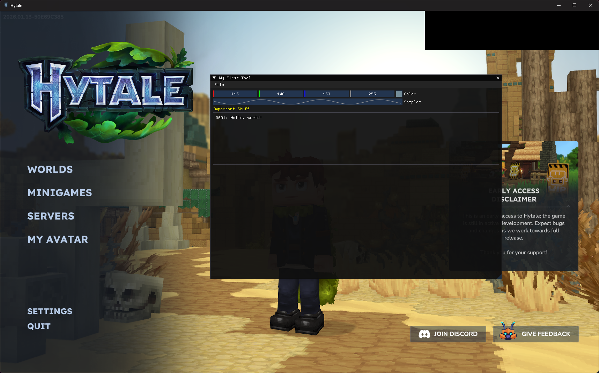

# Hytale Client ImGui
Hytale Client ImGui is a C++ DLL injection project that renders an ImGui overlay inside the Hytale client. The source is open to modification and can be adapted freely for experimentation and debugging.



## Tech Stack
* **Language:** C++20
* **UI Library:** [Dear ImGui](https://github.com/ocornut/imgui)
* **Hooking Library:** [funchook](https://github.com/kubo/funchook)
* **Build System:** CMake

### Build
``` bash
git clone https://github.com/reversedcodes/Hytale-Client-ImGui.git
cd Hytale-ImGui-Dll

mkdir build
cd build

cmake ..
cmake --build . --config Release
```
## Injector
[Cheat Engine](https://www.cheatengine.org/)

## License
This project is licensed under the [Apache License 2.0](LICENSE).  
You are free to use, modify, and distribute this software under the terms of the license.
